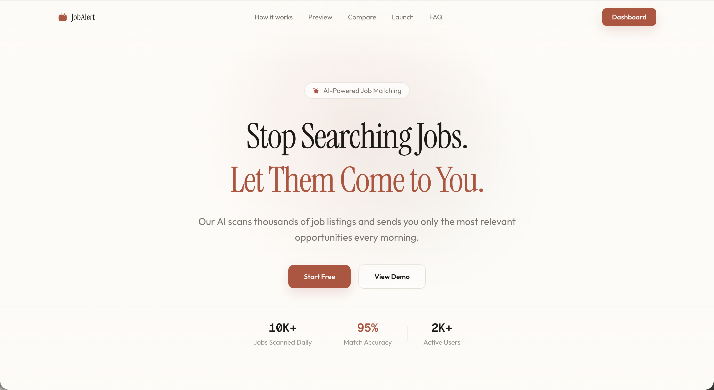
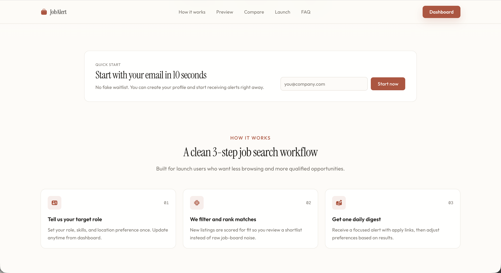
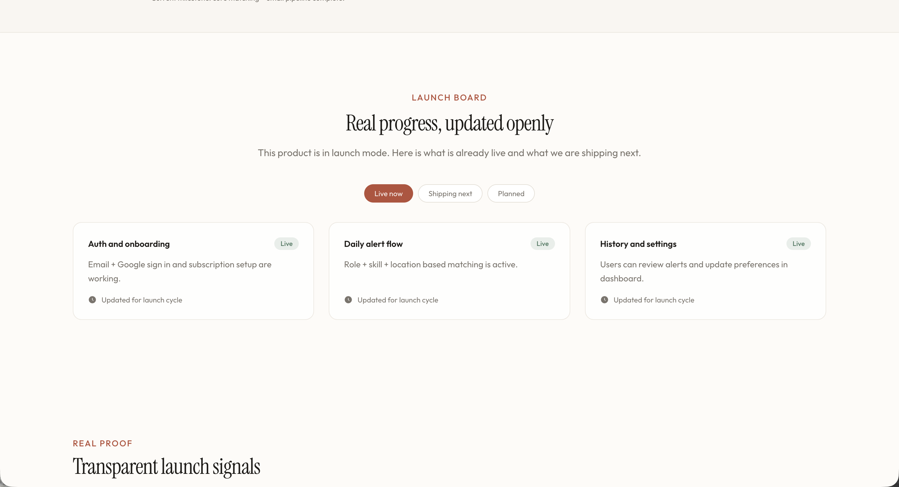
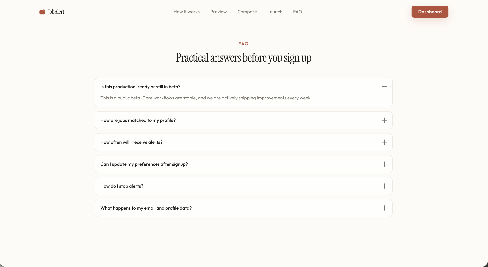
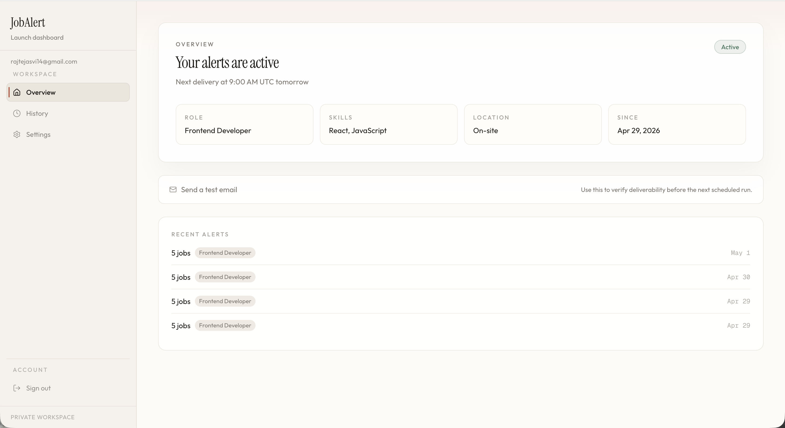

# JobAlert

Daily AI-powered job alerts for developers.

JobAlert helps developers set a role, skill profile, and location preference once, then receive a focused daily email digest with relevant jobs, match scores, and apply links. The app includes a launch landing page, Supabase authentication, a private dashboard, editable alert preferences, alert history, AI job filtering, Resend email delivery, and a protected cron endpoint for scheduled sends.

<p align="center">
  
</p>

## Screenshots

### Landing Page


### Dashboard



### Alert Setup



### Alert History



### Settings



## Features

- Developer-focused job alert landing page with pricing, FAQ, proof, testimonials, and CTA sections.
- Supabase auth with Google OAuth and email OTP login.
- Dashboard for creating an alert profile with role, skills, and location.
- Searchable role, skill, and location inputs.
- Daily job matching from RemoteOK jobs.
- OpenAI-powered filtering that returns the top matches with scores and reasons.
- Resend-powered HTML email digests with unsubscribe links.
- Alert history with previous sends and job counts.
- Settings page for editing alert preferences.
- Protected cron route for scheduled production delivery.
- Test email endpoint for checking deliverability before the next scheduled run.

## Tech Stack

- **Framework:** Next.js 16 App Router
- **UI:** React 19, TypeScript, Tailwind CSS v4, shadcn-style components
- **Auth and database:** Supabase
- **AI matching:** OpenAI
- **Email:** Resend
- **Scheduling:** Vercel Cron
- **Animations:** Framer Motion, GSAP

## Getting Started

Install dependencies:

```bash
npm install
```

Create `.env.local` in the project root:

```env
NEXT_PUBLIC_SUPABASE_URL=
NEXT_PUBLIC_SUPABASE_PUBLISHABLE_KEY=
SUPABASE_SERVICE_ROLE_KEY=
OPENAI_API_KEY=
RESEND_API_KEY=
CRON_SECRET=
NEXT_PUBLIC_SITE_URL=http://localhost:3000
NEXT_PUBLIC_SUPPORT_EMAIL=support@jobalert.app
```

Run the development server:

```bash
npm run dev
```

Open [http://localhost:3000](http://localhost:3000).

## Scripts

```bash
npm run dev      # Start the local development server
npm run build    # Create a production build
npm run start    # Start the production server
npm run lint     # Run ESLint
```

## Environment Variables

| Variable | Required | Purpose |
| --- | --- | --- |
| `NEXT_PUBLIC_SUPABASE_URL` | Yes | Supabase project URL used by browser and server clients. |
| `NEXT_PUBLIC_SUPABASE_PUBLISHABLE_KEY` | Yes | Public Supabase key for authenticated client access. |
| `SUPABASE_SERVICE_ROLE_KEY` | Yes | Server-only key for cron, history inserts, and privileged reads. |
| `OPENAI_API_KEY` | Yes | Used to rank and filter jobs for each subscriber. |
| `RESEND_API_KEY` | Yes | Sends job alert and test emails. |
| `CRON_SECRET` | Recommended | Protects the cron endpoint in production. |
| `NEXT_PUBLIC_SITE_URL` | Recommended | Base URL used for unsubscribe links. |
| `NEXT_PUBLIC_SUPPORT_EMAIL` | Optional | Support email displayed on marketing pages. |

## Project Structure

```text
app/
  (marketing)/              Landing page, privacy, terms, Open Graph image
  (auth)/                   Login routes and auth UI
  (dashboard)/dashboard/    Protected dashboard, history, settings
  api/cron/                 Daily scheduled alert sender
  api/subscribe/            Alert profile creation endpoint
  api/test-email/           Manual deliverability test endpoint
  api/unsubscribe/          Email unsubscribe endpoint
components/
  landing/                  Marketing page sections
  ui/                       Shared UI primitives
lib/
  email.ts                  Resend email template and sender
  jobs.ts                   RemoteOK fetcher and OpenAI filtering
  supabase-*.ts             Supabase browser and server clients
public/
  1.png ... 5.png           README screenshots
```

## Database Overview

The app expects two main Supabase tables:

### `user_roles`

Stores each user's active alert profile.

- `id`
- `email`
- `role`
- `skill`
- `location`
- `user_id`
- `created_at`

### `job_alert_history`

Stores completed alert sends and the jobs included in each digest.

- `id`
- `user_id`
- `subscriber_id`
- `email`
- `role`
- `jobs`
- `job_count`
- `sent_at`

Row Level Security should be enabled. User-facing reads and updates should be scoped to the authenticated user, while scheduled inserts should use the Supabase service role key on the server only.

## Cron Delivery

The cron endpoint lives at:

```text
GET /api/cron
```

In production, call it with:

```http
Authorization: Bearer <CRON_SECRET>
```

The cron flow is:

1. Read active subscribers from Supabase.
2. Fetch recent jobs from RemoteOK.
3. Filter and rank jobs with OpenAI for each subscriber profile.
4. Send the top matches using Resend.
5. Store the sent alert in `job_alert_history`.

## Notes

- This project uses Next.js 16, so check `node_modules/next/dist/docs/` before changing framework APIs.
- No test runner is currently configured.
- Keep service role keys and API keys server-side only.
